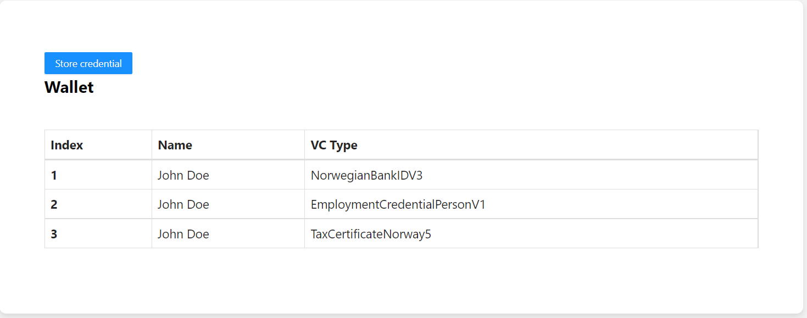

# Holder's web wallet powered by Affinidi API
This is a react application that offers a web UI and uses Affinidy's API to store verifiable credentials. The portal can also be used to create verifiable presentation and offers advanced properties like selective disclosure. Once the credential is stored, it can be shared with different services.
## Pre-requisite
- [npm](https://www.npmjs.com/get-npm)
- [git](https://git-scm.com/download)

## Installation

`npm install`

Install using npm instead of yarn because the current package-lock.json was
generated using npm.

## Available Scripts

In the project directory, you can run:

### `npm start`

Runs the app in the development mode.\
Open [http://localhost:3001](http://localhost:3001) to view it in the browser.
Assuming Issuer app is running on port:3000

The page will reload if you make edits.\
You will also see any lint errors in the console.

### `npm test`

Launches the test runner in the interactive watch mode.\
See the section about [running tests](https://facebook.github.io/create-react-app/docs/running-tests) for more information.

### `npm run build`

Builds the app for production to the `build` folder.\
It correctly bundles React in production mode and optimizes the build for the best performance.

The build is minified and the filenames include the hashes.\
Your app is ready to be deployed!

## Steps to store and share credentials:

### Prepare holder portal
1. Clone the repository
`https://github.com/Anushka3174/Holder-Portal.git`
3. Install the dependencies
`npm install`
4. Open up the repository in a code editor of your choice

### Running the application

1. Run with npm
`npm start`
2. The web app will run on 'http://localhost:3001/'.
3. Create an account through the 'Sign Up' menu on the top right or use the given credential: Username:applicantHolder Password: Pass1234
4. The homepage shows all the credential that is stored so far. On the top, a button 'Store credential' can be clicked to store any new credentials

6.This portal is also used to share credentials. When verifier portal asks for certain documents it gets redirected to 'http://localhost:3001/' assuming that the issuer portal is running on port 3000 and the verifier portal is running on port 3002. The required credential can be selected and a verifier presentation can be shared.

## Learn More

You can learn more in the [Create React App documentation](https://facebook.github.io/create-react-app/docs/getting-started).

To learn React, check out the [React documentation](https://reactjs.org/).
